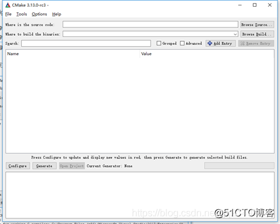
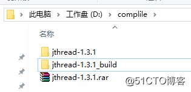
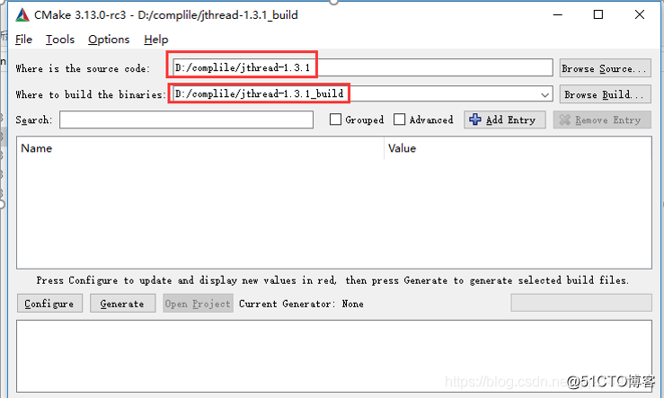
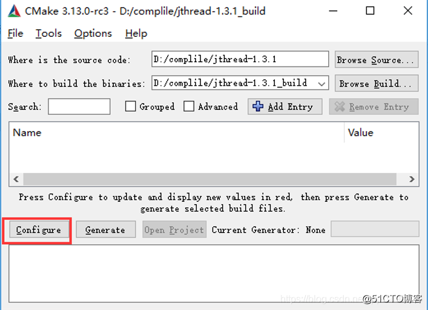
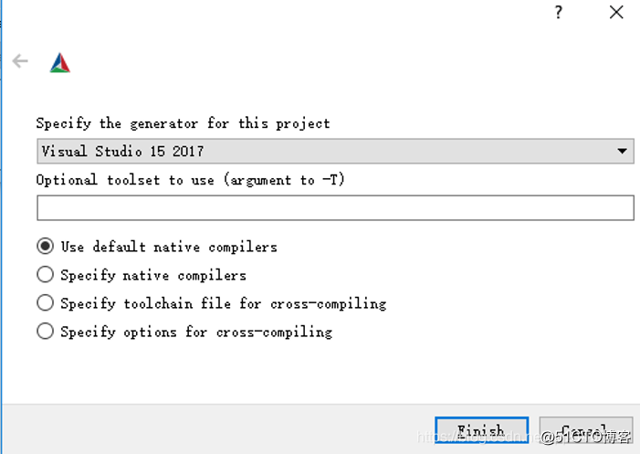
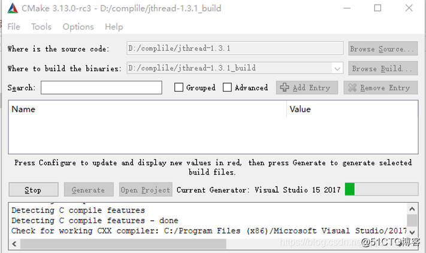
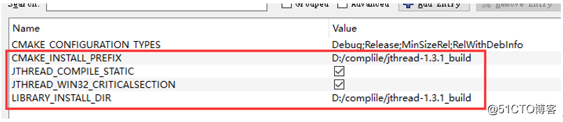
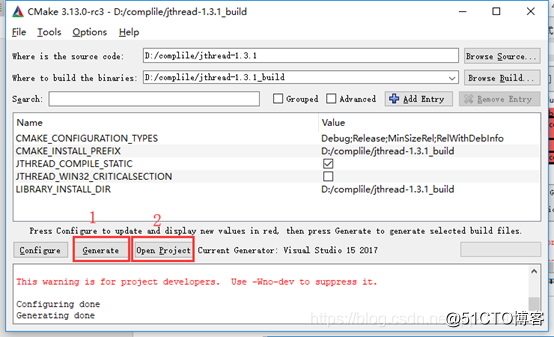
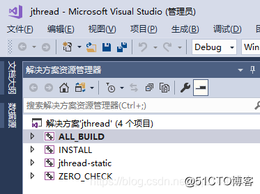

# JRtplib开发笔记（一）：JRtplib简介、JThread库编译

目录

 前话

 2019年12月6日补充

 JRTPLIB介绍

 CMake介绍

 JThread编译

 步骤一：下载JThread1.3.1并解压，如下图：

 步骤二：新建jthread-1.3.1_build文件夹，打开CMake设置好源码路径和编译路径，如下图：

 步骤三：点击Configure配置编译环境和环境变量(笔者使用环境为VS2017)

 步骤四：点击Generate、打开工程

 步骤五：编译release和debug

无线同屏技术开发支撑技术

 

JRtplib开发笔记（一）：JRtplib简介、JThread库编译
 

前话

项目中局域网AP需要达到60个点的同屏，经过多方实测，最终根据实际效果采用rtp+fec，帧率可以达到每秒5-15帧（实测）。

因为应用层使用wpf开发（C#），方案选型时使用了微软提供的rtp库，在项目上线前的实测阶段发现该库存在重大bug（rtpSession会话掉线后，无法再加入，重启软件、重新连接网络都不行，只能重启，且同一时刻启动电脑50台固定随机3-5台出现），该库是微软高度封装的rtp库，无法解决，最终依据之前几个项目的经验，核心库功能库除非必须使用微软提供的库(C#)或者组件。

往后笔者将会尽量使用C、C++和平台编程开发，不论是cpu占用率，内存管控和效率，都有大量的提升，还能移植不同平台。

 

2019年12月6日补充

该方案在2018年11月最终成功同屏，60台在一个AP局域网下，真同屏效果预期达到原先预期，且已经跨windows、linux、android，优化了库底层源码、压缩比以及其他细节，2019年3月至11月随项目改进优化几个版本，优化已超预期效果，目前得到行业内各大客户好评，公开课常用，且仅因为同屏，多客户选择使用我司系统而放弃其他中大厂同类产品。

 

JRTPLIB介绍

JRtplib是一个用C++编写的面向对象的库，旨在帮助开发人员使用RFC3550中描述的实时传输协议（RTP），该库可以提供接口给开发者实现RTP发送和接收数据，而无需担心SSRC冲突、调度和传输RTCP数据等。用户只需要向库提供发送的有效负载数据，并且味苦提供访问传入的RTP和RTCP数据即可。

编译JRtplib封装了多平台的多线程，使用起来只需要固定的几个类即可实现跨平台，此处提到JThread库是因为JRtplib中可以支持使用JThread库。

 

CMake介绍

笔者使用的开发环境是VS2017， JRTPLIB封装到C库中给C#调用，我们先编译JThread库，需要使用到CMake。

CMake是一个工程文件生成工具。用户可以使用预定义好的CMake脚本，根据自己配置选择开发环境（像是Visual Studio, Code::Blocks, Eclipse）生成不同IDE的工程文件。

Cmake下载地址：javascript:void(0)

解压后直接运行cmake-gui.exe

 

解压后直接运行cmake-gui.exe

JThread编译

当前版本最新的是1.3.1版本：

官网地址： http://research.edm.uhasselt.be/jori/page/CS/Jthread.html

CSDN地址：javascript:void(0)

**步骤一：下载JThread1.3.1并解压，如下图：**
        

**步骤二：新建jthread-1.3.1_build文件夹，打开CMake设置好源码路径和编译路径，如下图：**
        

        

**步骤三：点击Configure配置编译环境和环境变量(笔者使用环境为VS2017)**

点击Finished，等待配置：

修改环境变量，并确认使用静态编译，如下图

（补充：笔者为什么使用静态编译？情景一：项目测试时，50台设备，同样的硬件设备，同样的ghost系统，同样的初始化步骤，存在几台总是出现运行无反应，实际时起来了，但是c/c++库挂了；情景二：此台开发机编译后可直接exe运行，另外一台开发机却exe不行，搭建环境步骤一样，本质原因是C/C++以及系统dll等问题；综合以上原因，直接使用静态编译，避免出现这种因环境造成的运行问题）。

 

**步骤四：点击Generate、打开工程**

**步骤五：编译release和debug**

分别生成debug和release版本

        

 

 
- 《JRtplib开发笔记（一）：JRtplib简介、JThread库编译》: javascript:void(0)/article/details/84785284
- 《JRtplib开发笔记（二）：JRtplib库编译、示例演示》: javascript:void(0)/article/details/84785593
- 《JRtplib开发笔记（三）：JRtplib库编程使用说明》: javascript:void(0)/article/details/84957120
- 《JRtplib开发笔记（四）：JRtplib的VS开发环境搭建以及Demo》: javascript:void(0)/article/details/84957708

-----------------------------------

©著作权归作者所有：来自51CTO博客作者长沙红胖子的原创作品，请联系作者获取转载授权，否则将追究法律责任

JRtplib开发笔记（一）：JRtplib简介、JThread库编译

https://blog.51cto.com/hongpangzi/3622133
