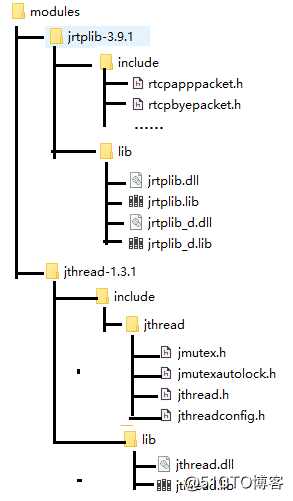

# JRtplib开发笔记（三）：JRtplib库编程使用说明

前话

前面编译了jthread，jrtplib以及解析了源码自带示例，接下来介绍jrtplib的使用。

 

JRtplib使用说明

**步骤一：使用JRtplib类需要先引入命令空间，如下：**

	using namespcace jrtplib;

**步骤二：使用JRtplib需要创建一个RTPSession对象，类似于全局上下文句柄**

	RTPSession rtpSession;

**步骤三：创建会话，您必须调用Create成员函数，该函数有两个参数：**

第一个参数是RTPSessionParams类型，并指定会话的常规选项。必须显式设置此类的一个参数，否则将无法成功创建会话，此参数是要发送的数据的时间戳单位，可以通过将某个时间间隔（以秒为单位）除以该时间间隔内的样本数来计算，还可以设置是否接收数据包；

```
RTPSessionParams sessionparams;
// 时间戳：1秒钟8000个样本
sessionParams.SetOwnTimestampUnit(1.0/8000.0)
// 设置是否接收属于本身的数据,true-接收,false-不接收
sessionParams.SetAcceptOwnPackets(true)
```

第二个参数是指向RTPTransimissionParams实例的指针，并描述传输组件的参数，默认情况下，使用UDP over IPv4发送器，对于此特定发送其，传输参数应为RTPUDPv4RransmissionParams类型。

```
RTPUDPv4TransmissionParams transparams;
// 设置本地接收的端口号
transparams.SetPortbase(8000)
```

如果库是使用JThread支持编译的，则传入的数据将在后台处理。如果在编译时未启用JThread支持，或者如果您在会话参数中指定不应使用轮询线程，则必须定期调用RTPSession成员函数Poll来处理传入数据并在必要时发送RTCP数据。

 

**步骤四：加入监听地址列表**

加入地址（包括ip地址和端口号），

发送端

若是发送端则是发送的目标地址，点对点发送与多播（组播）发送操作代码不区分：

```
char destIp [16] = “224.0.0.1”;
int destPort = 10000;
RTPIPv4Address addr(ntohl(inet_addr(destIp)), destPort);
status = sess.AddDestination(addr);
if (status < 0)
{
  std::cerr << RTPGetErrorString(status) << std::endl;
  exit(-1);
}
```

接收端

若是接收端则是设置本地监听目标地址，一般是“127.0.0.1”和端口号：

```
char destIp [16] = “127.0.0.1”;
int destPort = 10000;
RTPIPv4Address addr(ntohl(inet_addr(destIp)), destPort);
status = session.AddDestination(addr);
if (status < 0)
{
  std::cerr << RTPGetErrorString(status) << std::endl;
  exit(-1);
}
```

组播则是组播地址+端口号，并且加入组播地址

```
char groupIp[16] = “224.0.0.1”;
int port = 10000;
RTPIPv4Address addr(ntohl(inet_addr(groupIp)), port);
_rtpSession.JoinMulticastGroup(addr);
```

**步骤五：开始接收/发送**

先使用GotoFirstSourceWidthData获取收到的数据源，然后开始循环接收，定义数据包的指针RTPpacket，然后进入循环接收是否有数据包GetNextPacket有的画返回非NULL，获取数据长度和收到的数据，可对数据进行处理，这里特别注意每次接收完成后需要调用DeletePacket对数据包进行删除，结合了发送和接收的代码如下：

```
// 开始接收数据
_rtpSession.BeginDataAccess();
if (_rtpSession.GotoFirstSourceWithData())
{
  do {
     // 数据包指针
     RTPPacket *packet;
     while ((packet = _rtpSession.GetNextPacket()) != NULL)
     {
       // 获取接收数据长度
       unsigned int recvSize = packet->GetPayloadLength();
       // 获取接收数据
       unsigned char * recvData = (unsigned char *)packet->GetPayloadData();
       // 删除数据包
       _rtpSession.DeletePacket(packet);
       // 获取下一个有数据的数据源（rtp加入监听地址的源）
     } while (_rtpSession.GotoNextSourceWithData());
  }
  // 关闭接收数据
  _rtpSession.EndDataAccess();
  // 睡眠100ms
  RTPTime::Wait(RTPTime(0, 100));
}
```

**步骤六：退出发送或者接收**

发送退出记得释放内存即可，但是接收退出有两点要注意：

第一点是若是开始接收数据BeginDataAccess一定要调用EndDataAccess否则不会关掉jthread线程，不会马上退出，退出不了也就无法重新Create

第二点是接收了数据包则一定要调用DeletePacket数据包，然后调用销毁和等待退出，只要调用了EndDataAccess，AboutWait基本上是立即返回的，秒开秒关。

```
_rtpSession.Destroy();
_rtpSession.AbortWait();
```

JRtplib模块化
      


编译的静态库，不然在调用该库运行的时候根据windows sdk版本问题，导致直接运行无反应，避免这些坑直接使用静态库，带”_d”的是debug版本的库。


-----------------------------------

©著作权归作者所有：来自51CTO博客作者长沙红胖子的原创作品，请联系作者获取转载授权，否则将追究法律责任

JRtplib开发笔记（三）：JRtplib库编程使用说明

https://blog.51cto.com/hongpangzi/3618968
