# JRtplib开发笔记（二）：JRtplib库编译、示例演示

**前话**

前面编译了JThread，继续编译JRtplib库，直接进入正题，依赖上篇文章编译的JThread文件。

《 JRtplib开发笔记（一）：JThread库编译》：​

**JRtplib编译**

当前最新的是3.11.1版本：

官网地址：​ ​http://research.edm.uhasselt.be/jori/page/CS/Jrtplib.html​​

​

**步骤一：下载JRtplib3.11.1并解压，如下图：**
       
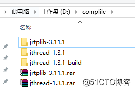

**步骤二：新建jrtplib-3.11.1_build文件夹，打开CMake设置好源码路径和编译路径，如下图：**
       
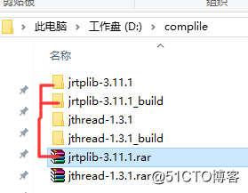

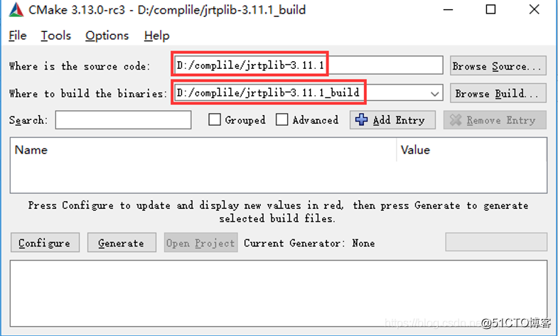

**步骤三：点击Configure配置编译环境和环境变量(笔者使用环境为VS2017)**
       
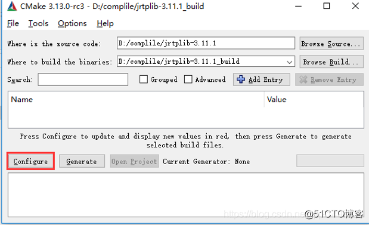

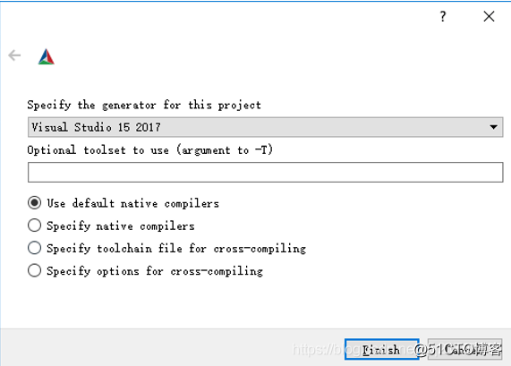

点击Finished，等待配置：

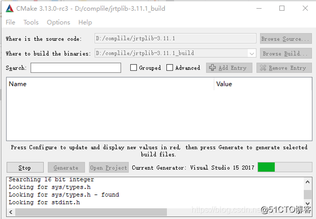

修改环境变量，并确认使用静态编译，如下图

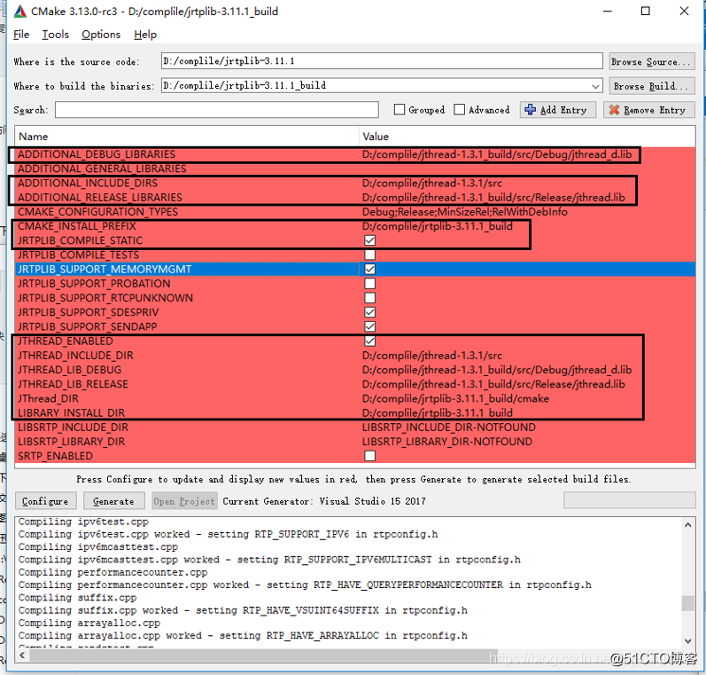

**步骤四：点击Generate、打开工程**

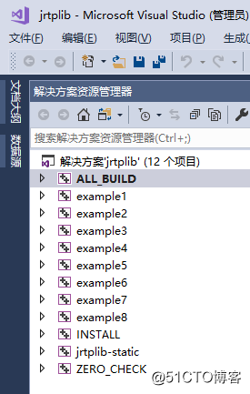

**步骤五：编译release和debug**

编译时，出现错误，如下图：

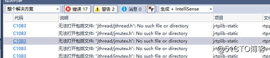

我们并没有发现jthread文件夹，应该时jrtplib调用jthread时自己建立的文件夹吧，所以找不到，我们能找到jthread.h和jmutex.h，建个一样的路径包括进去就好了，如下图：

    
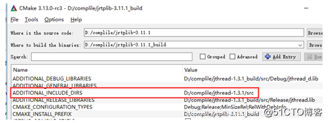

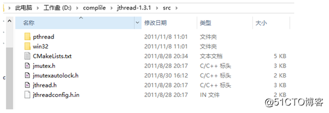

新建jthread文件夹，复制jmute.h和jthread.h放入其中：

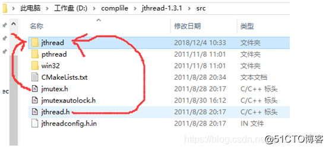

继续使用VS2017编译，出现错误“jthreadconfig.h”，如下图：

复制jthreadconfig.h（此文件生成依赖编译器和平台），如下：

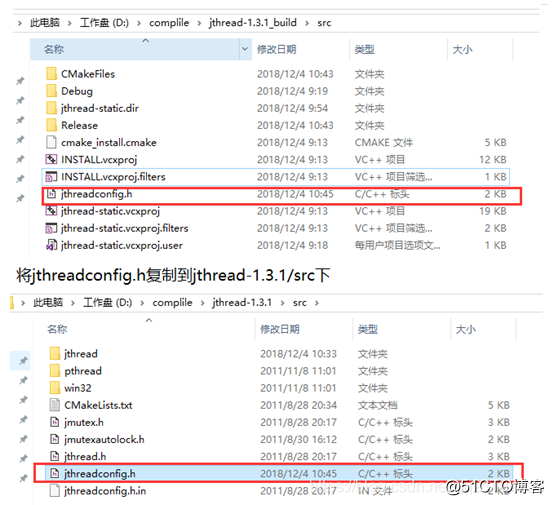

继续使用VS2017编译，如下图：

**运行JRtplib示例example1**

发送与接收核心部分源码

（自带源码固定了发送的数据内容和数据间隔）

运行过程：

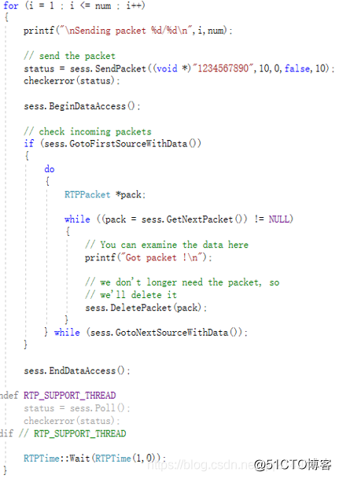

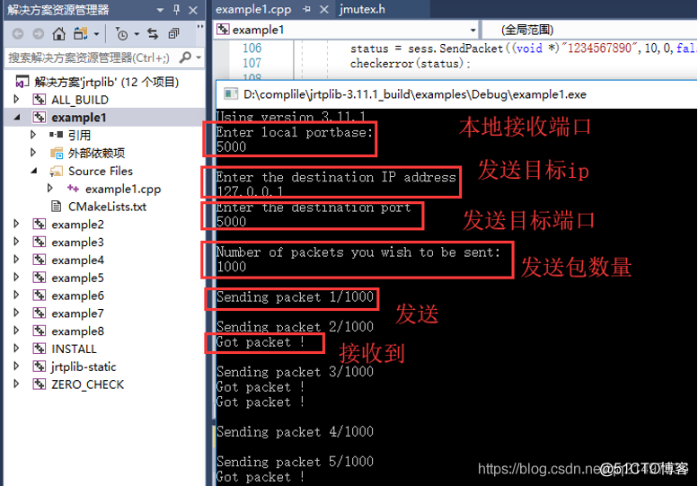

至此JRtplib开发库全程编译完成。

编译后的文件包下载地址
​

《JRtplib开发笔记（一）：JRtplib简介、JThread库编译》​

《JRtplib开发笔记（二）：JRtplib库编译、示例演示》: ​

《JRtplib开发笔记（三）：JRtplib库编程使用说明​

《JRtplib开发笔记（四）：JRtplib的VS开发环境搭建以及Demo》: ​

©著作权归作者所有：来自51CTO博客作者长沙红胖子的原创作品，请联系作者获取转载授权，否则将追究法律责任

JRtplib开发笔记（二）：JRtplib库编译、示例演示

https://blog.51cto.com/hongpangzi/5225633