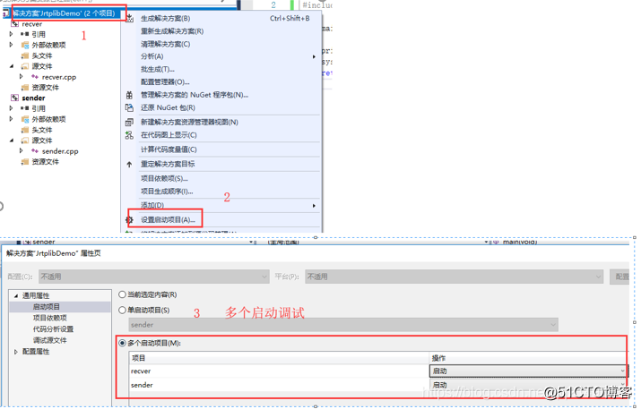

# JRtplib开发笔记（四）：JRtplib的VS开发环境搭建以及Demo

JRtplib开发笔记（四）：JRtplib的VS开发环境搭建以及Demo
 

前话

前面介绍了JRtplib的使用，接下来介绍如何加入到工程项目中，并使用该工程项目写一个简单的使用Demo。

 

搭建JRtplib开发环境（VS2017,VC++）

因为没有带Fec，所以传输数据还是会有丢包的情况，这点需要提醒读者，但是如果是局域网有线网络，基本可以忽略丢包的问题，但是如果是使用无线网AP那么首先AP要支持组播，其次组播丢包那是很严重的，如果传图基本是很难收完整的。


下面介绍写了一个简单的rtp接受端和客户端，接受端只发送，客户端只接收。在使用jrtplib之前需要将其添加进工程，当前我们以VS作为IDE，写一个VC程序（使用C语言调用C++），其他IDE参考VS即可，调用外部库不外乎就是三点：

- 引用时需要的头文件
- 编译时需要的dll/lib/.a（此处需要dll与运行时需要的dll一样）
- 运行时需要的dll（此处与编译时需要的dll一样）

**步骤一：新建JrtplibDemo工程**

使用VS2017新建VC++空工程，移除创建的项目，然后再添加sender和recver两个项目：


为了调试方便，我们启用多个项目调试，即运行时可设置运行调试哪些项目，如下图：



运行时，如下图：


**步骤二：项目引用Jrtplib头文件和库文件**

将之前的modules模块文件夹引入到工程中，


引入头文件：

  

引入库文件


复制库文件（运行时也需要使用库，所以需要将库dll文件复制到exe输出目录下）


 

Demo演示

    可以设置时间戳，包间间隔，负载类型等等，此Demo未附带

**发送端源码**

```
#include <stdio.h>
#include <stdlib.h>

// rtp库依赖socket,必须再rtp库引入之前添加，否则会出各种错误
#include <WinSock2.h>
#pragma comment(lib, "ws2_32.lib")

// rtp库引入
#include "rtpsession.h"
#include "rtpudpv4transmitter.h"
#include "rtpipv4address.h"
#include "rtpsessionparams.h"
#include "rtperrors.h"
#pragma comment(lib, "jrtplib.lib")

using namespace jrtplib;

int main(void)
{
  RTPSession  rtpSession;
  R TPSessionParams rtpSessionParams;
  RTPUDPv4TransmissionParams rtpUdpv4Transmissionparams;

  char buf[1024] = { 0x00 };
  char ip[16] = { 0x00 };
  int port = 0;
  int ret = 0;

  // 容易忽略，因为自写代码中没有调用socket，rtp有调用但是没有初始化
  WSADATA dat;
  WSAStartup(MAKEWORD(2, 2), &dat);

  printf("This is sender!!!\n");

  printf("Input destination ip:");
  scanf("%s", ip);
  printf("Input destination port:");
  scanf("%d", &port);
  printf("Destination %s:%d\n", ip, port);

  rtpSessionParams.SetOwnTimestampUnit(1.0 / 1);
  rtpSessionParams.SetUsePollThread(true);
  rtpSessionParams.SetAcceptOwnPackets(false);
  ret = rtpSession.Create(rtpSessionParams, &rtpUdpv4Transmissionparams);
  if (ret < 0)
  {
    printf("Failed to RtpSession::Create, ret=%d\n", ret);
  }

  RTPIPv4Address addr(ntohl(inet_addr(ip)), port);
  rtpSession.AddDestination(addr);

  while (true)
  {
    printf("Input message:");
    scanf("%s", buf);
    if (strcmp(buf, "exit") == 0)
    {
      break;
    }
    ret = rtpSession.SendPacket((void *)buf, strlen(buf), 0, false, 1);
    if (ret < 0)
    {
      printf("Failed to RtpSession::SendPacket, ret=%d\n", ret);
      continue;
    }
    else {
      printf("Succeed to RtpSession::SendPacket!!!\n");
    }
    RTPTime::Wait(RTPTime(0, 100));
  }
  return 0;
}
```

接收端源码

```
#include <stdio.h>
#include <stdlib.h>

// rtp库依赖socket,必须再rtp库引入之前添加，否则会出各种错误
#include <WinSock2.h>
#pragma comment(lib, "ws2_32.lib")

// rtp库引入
#include "rtpsession.h"
#include "rtpudpv4transmitter.h"
#include "rtpipv4address.h"
#include "rtpsessionparams.h"
#include "rtperrors.h"
#include "rtppacket.h"
#pragma comment(lib, "jrtplib.lib")

using namespace jrtplib;

int main(void)
{
  RTPSession  rtpSession;
  RTPSessionParams rtpSessionParams;
  RTPUDPv4TransmissionParams rtpUdpv4Transmissionparams;

  char ip[16] = "127.0.0.1";
  int port = 0;
  int ret = 0;
  char buf[1024] = { 0x00 };

  // 容易忽略，因为自写代码中没有调用socket，rtp有调用但是没有初始化
  WSADATA dat;
  WSAStartup(MAKEWORD(2, 2), &dat);

  printf("This is recver!!!\n");

  printf("Input local port:");
  scanf("%d", &port);
  printf("recv %s:%d\n", ip, port);

  rtpSessionParams.SetOwnTimestampUnit(1.0 / 1);
  rtpSessionParams.SetUsePollThread(true);
  rtpSessionParams.SetAcceptOwnPackets(true);
  rtpUdpv4Transmissionparams.SetPortbase(port);
  ret = rtpSession.Create(rtpSessionParams, &rtpUdpv4Transmissionparams);
  if (ret < 0)
  {
    printf("Failed to RtpSession::Create, ret=%d\n", ret);
  }

  RTPIPv4Address addr(ntohl(inet_addr(ip)), port);
#if 0
  // 组播
  rtpSession.JoinMulticastGroup(addr);
#else
  // 本机接收，127.0.0.1
  rtpSession.AddDestination(addr);
#endif

  while (true)
  {
    rtpSession.BeginDataAccess();
    if (rtpSession.GotoFirstSourceWithData())
    {
      do {
        RTPPacket *packet;
        while ((packet = rtpSession.GetNextPacket()) != NULL)
        {
          unsigned int recvSize = packet->GetPayloadLength();
          unsigned char * recvData = (unsigned char *)packet->GetPayloadData();
          memcpy(buf, recvData, recvSize);
          buf[recvSize] = '\0';
          printf("recv %d, message: %s\n", recvSize, buf);
          rtpSession.DeletePacket(packet);
        }
      } while (rtpSession.GotoNextSourceWithData());
    }
    rtpSession.EndDataAccess();
    RTPTime::Wait(RTPTime(0, 100));
  }
  return 0;
}
```

运行Demo效果


Demo下载地址

javascript:void(0)

 

- 《JRtplib开发笔记（一）：JRtplib简介、JThread库编译》: javascript:void(0)/article/details/84785284
- 《JRtplib开发笔记（二）：JRtplib库编译、示例演示》: javascript:void(0)/article/details/84785593
- 《JRtplib开发笔记（三）：JRtplib库编程使用说明》: javascript:void(0)/article/details/84957120
- 《JRtplib开发笔记（四）：JRtplib的VS开发环境搭建以及Demo》: javascript:void(0)/article/details/84957708

-----------------------------------

©著作权归作者所有：来自51CTO博客作者长沙红胖子的原创作品，请联系作者获取转载授权，否则将追究法律责任

JRtplib开发笔记（四）：JRtplib的VS开发环境搭建以及Demo

https://blog.51cto.com/hongpangzi/3620259
