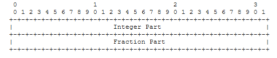
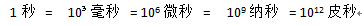

# NTP时间戳和UTC时间戳互转及其原理 #

## 1.NTP时间戳 ##

NTP时间戳是用一个64bit的无符号的定点数表示。它表示自从1900年1月1日00:00 到现在过了多少秒。64bit分为两部分，高32bit表示整数部分，单位是秒；低32bit表示小数部分，单位是232皮秒（picosecond）。



## 2.UTC时间戳 ##

格林威治时间1970年01月01日00时00分00秒(北京时间1970年01月01日08时00分00秒)起至现在的总秒数，表示为：1970-01-01 00:00:00 UTC。程序里面习惯性叫做utc时间戳。

## 3.秒一些时间单位 ##

毫秒（millisecond）是一种较为微小的时间单位，是一秒的千分之一（0.001秒），简称ms

微秒（microsecond）即百万分之一秒（10的负6次秒），简称μs

纳秒（nanosecond）即一秒的10亿分之一（10的负9次秒），简称ns，又名“毫微秒”

皮秒（picosecond）即纳秒的千分之一（10的负12次方秒），简称ps

## 4.UTC转NTP ##

UTC时间戳以毫秒为单位。如果单位是秒的话，直接就是讲utc的时间左移32，就是NTP时间戳了。

第一步首先计算NTP的高32位，是多少秒。

UTC时间戳是从1970-01-01 00:00:00  NTP时间戳是从1900-01-01 00:00，所以首先NTP和UTC就差了70年。换算成秒的话就是 60 * 60 * 24 * （365 * 70 + 17） 其中1900到1970年有17个闰年，多17天。

NTP高32位就可以计算出来了等于   UTC整除1000 + 70年的秒数。

假设UTC时间戳是 n毫秒： (n / 1000) + 60 * 60 * 24 * （365 * 70 + 17）

第二步 计算NTP的低32位，是多少（232皮秒）

首先看看这个单位怎么来的。低32位代表小数部分。也就是说最大等于1秒。

。 而 32位最大是4294967295 = 2的32次幂。比10的12次幂小。那么32位里面的1表示多少皮秒呢。直接拿10的12次幂除以2的32次方，算下来约等于232皮秒。所以低32位的单位是232皮秒。

UTC的毫秒对1000取余即 n % 1000。算出来是不够一秒的数。假设算出来的是m， 那m是多少232皮秒呢。m的单位是毫秒换算成皮秒的话就是 m 乘 10的9次幂。

低32位的值就是：m * 10(9次幂) / 232

```
#define  SECOND_70_YEAR (60 * 60 * 24 * (365 * 70 + 17))
 
unsigned long long utc2ntp(unsigned long long n)
{
    unsigned int H32bit, L32bit;
    unsigned long long ntpTime;
    
    H32bit = n / 1000 + SECOND_70_YEAR;
    L32bit = (n % 1000) * 1000000000 / 232;
    ntpTime = H32bit << 32 | L32bit;
    return ntpTime;
}
```

## 5.NTP转UTC ##

根据上面的UTC转NTP，很容易反推出NTP 转UTC的方法

```
unsigned long long ntp2utc(unsigned long long n)
{
    unsigned int H32bit, L32bit;
    unsigned long long utcTime;
 
    H32bit = (unsigned int)(n >> 32) - SECOND_70_YEAR;
    L32bit = (unsigned int)(n & 0xffffffff) * 232 / 1000000000;
    utcTime = H32bit * 1000 + L32bit;
    return utcTime;
}
```
6.上面的转换存在一定的舍弃，可以用算术位移的方法计算

MS_TO_NTP_lOW对这个宏做个解释 NTP低32位单位是 10的12次幂除以2的32次幂。 毫秒x是这个单位的多少倍就是 x 乘 10的9次幂 除(10的12次幂除以2的32次幂)。根据关系转换一下就变成了x 乘 2的32次幂 除 10的3次幂。 2的32次幂是算术左移32位。

```
#define  SECOND_70_YEAR (60 * 60 * 24 * (365 * 70 + 17))
#define  MS_TO_NTP_lOW(x) (((unsigned long long)(x) << 32) / 1000)
#define  NTP_LOW_TO_MS(x) (((unsigned long long)(x) * 1000) >> 32)
unsigned long long utc2ntp(unsigned long long n)
{
    unsigned int H32bit, L32bit;
    unsigned long long ntpTime;
    
    H32bit = n / 1000 + SECOND_70_YEAR;
    L32bit = MS_TO_NTP_lOW(n % 1000);
    ntpTime = H32bit << 32 | L32bit;
    return ntpTime;
}
 
unsigned long long ntp2utc(unsigned long long n)
{
    unsigned int H32bit, L32bit;
    unsigned long long utcTime;
 
    H32bit = (unsigned int)(n >> 32) - SECOND_70_YEAR;
    L32bit = (unsigned int)(n & 0xffffffff);
    L32bit = NTP_LOW_TO_MS(L32bit);
    utcTime = H32bit * 1000 + L32bit;
    return utcTime;
}
```